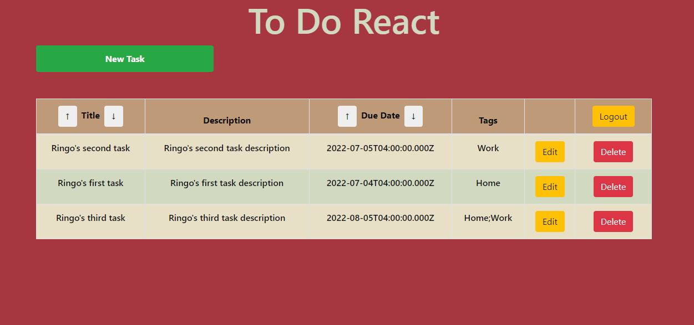

# to-do-react

---

## Description

To-do-react is an application designed to allow the user to keep track of their to-do list on a server that they can access from anywhere.

---

## Table of Contents

[Features](#features)

[Screenshot](#screenshot)

[Installation](#installation)

[Usage](#usage)

[License](#license)

[Contributing](#contributing)

[Questions](#questions)

---

## Features

      1. PostgreSQL Database

      2. React front end

      3.  User Authentication (Hashed passwords)

      4. Sequelize

      5. Express.js

---

## Screenshot

[Click to watch a video!](https://watch.screencastify.com/v/UtEDzHXwZglfPGRbJlgU)

---

## Installation

      1. Clone the repository

      2. CD /server and run npm install

      3. cd /to-do-react run npm install

      4. In the /server directory are postgreSQL commands to setup the server.

      5. CD /server/seeds/  node index.js to seed the server.

---

## Usage

      1. cd server npm run start

      2. cd to-do-react npm run start

---

## License

&emsp; 

      To read about the license of this project click the link below.

&emsp;[License](https://github.com/tgtiburon/to-do-react/blob/main/LICENSE)

---

## Contributing

      1. Email me, or leave a message on the issues tracker on github

---

## Questions

If you have any questions about this project feel free to email me at <tg.tiburon@gmail.com>.

To see the rest of my portfolio, visit [Github](https://github.com/tgtiburon).

Below is a graphic displaying my most used languages on github.

This Readme file was created with Readme Architect by Tony Gendreau &copy;
